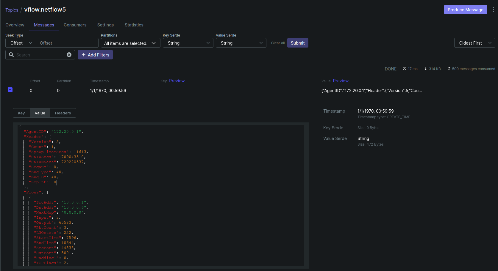

# FlowSight: Scalable SDN Network Flow Visualization

The scope of the project is to provide a scalable network flow visualizer for 
Software Defined Networks (SDN), ready to use with straightforward configuration. 

The visualization supports SDN developers in better visualizing flows on the network 
and how flows change in relation to slicing techniques.

## Abstract

During the project we found out that every router exports Netflow packets and we
use them as a datasource input for a PID controller, that allow us to split 
the SDN in different Queue, with different bandwidth and, for that reason, we found
out the best way to split the network every time instance.
The focus of the project after that is the representation of data and the data analytics
in ordert to obtain flow information and a sort of a "data-drive" approach.
The slicing algorithm is a **proof-of-concept** of the PID algorithm, that works moodulating
the frequency of bandwith and then apply that to the queue of Openswitch.

## Context and Project

During the course of this project, we extensively experimented with cutting-edge 
mechanisms and technologies to collect data and insights. 

In the project's early stages, we focused on the Netflow protocol. Our objective 
was to identify the most effective method for understanding the types of packets 
being transported across the network at a given time and quantifying their volume.

NetFlow is a network protocol developed by Cisco, designed for collecting IP traffic 
information and monitoring network flow. 
By analyzing NetFlow data, we aimed to gain a comprehensive understanding of network 
traffic flow and volume. 
This protocol is particularly useful for identifying the largest resource drains
on your bandwidth, enabling efficient and effective monitoring of traffic within 
the network. 
[SOURCE1](https://www.solarwinds.com/netflow-traffic-analyzer/use-cases/what-is-netflow)
[SOURCE2](https://www.kentik.com/kentipedia/what-is-netflow-overview/)

By leveraging NetFlow, we were able to record metadata about IP traffic flows traversing 
our network devices, such as routers, switches, or hosts. 
This metadata is crucial for determining network throughput, packet loss, and traffic 
congestion at specific interface levels (L3, in particular). 
Moreover, NetFlow data supports various network-level monitoring use cases, including 
DDoS detection and BGP peering 2. All of that sound intresting, but results in a increased
project complexity. Moreover, the resource needed to simulate a DDos attack are
high, and we did not like this idea. For that reason, we didn't use this function.

This initial phase of the project laid the groundwork for further exploration into 
state-of-the-art mechanisms and technologies, paving the way for more advanced 
data collection and analysis methods (like Kafka and Elasticsearch).

We discovered that OpenFlow routers natively generate Netflow packets, which 
facilitated our use of the vFlow project sponsored by Verizon. 
This project enabled us to collect and aggregate Netflow data in a industrial manner. 
The result of this process was a series of JSON files, each containing a 
comprehensive representation of the flow.

Despite not being mandatory, this process was chosen to attempt to establish a 
service capable of functioning effectively within an industrial setting. 

In such an environment, where continuous monitoring and visibility of the network's 
state are not only desirable but essential, this product stands out. 
Notably, this product is developed by Verizon.

Following this data collection phase, we employed a Kafka consumer to retrieve,
analyze, and parse these packets. This process allowed us to transform the entire 
network traffic into a format that our routers' controller could more easily interpret, 
specifically a Python `dict()`. 
This transformation enabled us to segment the flow by IP, optimizing network throughput 
and enhancing overall performance.

Our solution for flow segmentation was inspired by the concept of a Proportional-Integral-Derivative (PID) 
controller, similar to TCP's automatic ingestion control. 
However, the complexity of this operation was managed entirely by the controller, 
allowing us to apply this mechanism even to UDP packets on the network.

The entire network mapping is visualized through a sophisticated dashboard created in Grafana,
which collects information from the vFlow aggregation systems, vFlow data, and other usage graphs.

An example of a Netflow packets could be found in the asset directory (`assets/netflow.json`).

## Our Work

In practice, we dedicated efforts to comprehend the functionality of Netflow packets 
and the methodology for extracting data from consumers using Kafka.

Initially, the Kafka server specified in the docker-compose.yaml did not function as 
expected, prompting us to transition to lensesio/fast-data-dev. 
Additionally, we encountered significant challenges with Docker, particularly concerning Kafka's management.

Subsequently, we developed a custom dashboard in Grafana to more effectively illustrate 
the various types of traffic and the network and Netflow statuses.

The slicing mechanism works as this:
1. The kafka consumer elaborate on the netflow packets, every request that ryu-manager request data, 
this component repond with the last data elaborated. (Calculating flow and bandwidth)
2. The PID algorithm modulate the bandwidth of the queue, in order to obtain the best results on the current situation.

A Proportional-Integral-Derivative (PID) controller is a widely used control loop mechanism 
in industrial control systems and other applications requiring continuously modulated control. 
It calculates an error value as the difference between a desired setpoint and a measured 
process variable, and applies a correction based on proportional, integral, and derivative 
terms. The proportional term adjusts the output value in proportion to the current error, 
the integral term contributes to the accumulated offset that should have been corrected 
previously, and the derivative term helps to predict future errors and adjust accordingly
to prevent overshoot. This combination of terms allows the PID controller to respond to 
changes in the process variable, correcting errors in a way that minimizes overshoot and 
oscillation, and achieves a steady-state error close to zero.

Manca grafana screenshot, Kafka e Postgres.



## How to start with this project

We added port-forwarding for some services, the other ports are forwarded by the
**VC-CODE Live Share Extension**. If you could not access some ports, add forwarding
via this methods or others.

In ordert to port forward via Vagrant file, the ports that should be public are:

- `3000`: for Grafana
- `8085`: Postgres UI interface
- `8080`: Kafka UI (optional)
- `9090`: Prometheus (optional)

In some cases the database failed to be created, we should manually create. In order to 
do that:
1. Open on the browser the link `http://localhost:8085`
2. login with `postgres:example`, and select the type of database property as `PostgreSQL`.
3. In that page, click on create database.
4. Write `Netflow` on the name of the database and click `Save`.
5. We can close this interface.
Could be useful to create the database table. (`CREATE DATABASE IF NOT EXISTS Netflow;`)

We need to set this in order for the `Kafka` counsumer to work:
1. Config /etc/hosts

```sh
sudo echo "127.0.0.1 kafka" >> /etc/hosts
```
After that, we start the `docker-compose` services.
2. Start docker services

```sh
docker-compose up -f docker-compose/docker-compose.yml
```
3. Start `ryu-controller`, in ordert to have a demonstration of the netfow 
packets creation and management
```sh
ryu-manager switches/slicing.py
```
4. Start mininet
```sh
sudo mn -c && sudo -E python3 topo/topolino.py
```
5. Set Netflow Data exporters on OpenFlow's routers
```sh
bash ./qos/nf-setup.sh
```
6. Run the KafkaConsumer:
```bash
python3 switches/utils/kafkaconsumer.py
```
7. In order to generate some traffic on the network, we could lauch some `iperf`

8. Visualize the flow on Grafana `localhost:3000`

## Conclusion

Throughout this experience, we discovered that Netflow technology 
facilitates a deeper comprehension of network utilization by employing 
a more concise representation of information. This conciseness enables 
the aggregation of various flows to derive more accurate statistical insights.

This approach shifts the complexity from the network appliance, 
streamlining systems and enhancing their speed by extracting the 
analytical phase from the decision-making process.

This outcome can be considered a partial achievement, as the data gathered 
significantly enhance network visibility. 
However, it's important to note that these improvements do not directly 
augment the visibility of the network's physical components, since 
Netflow operates at the network layer (Layer 3).
